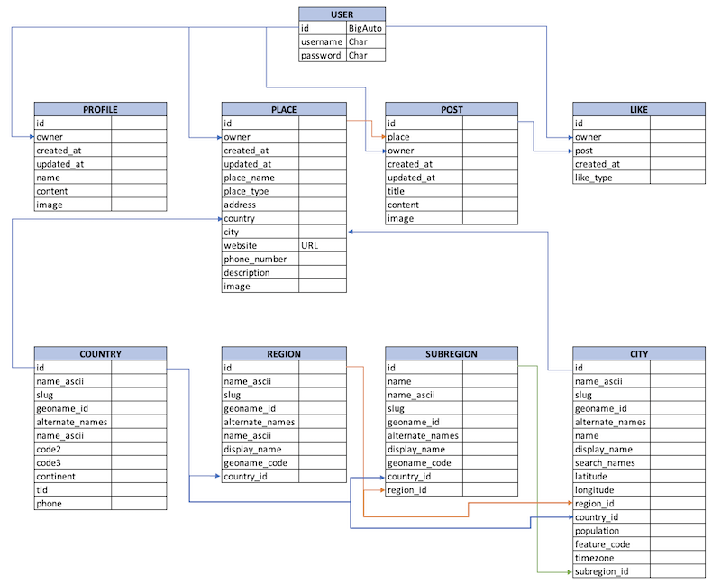
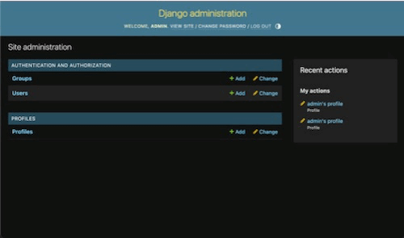
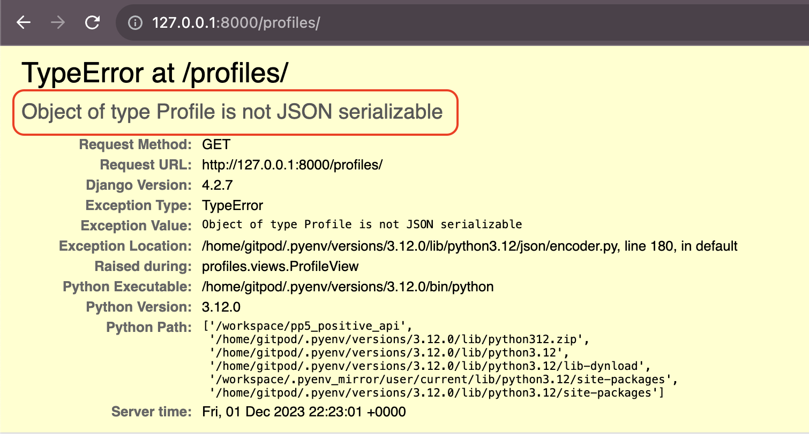
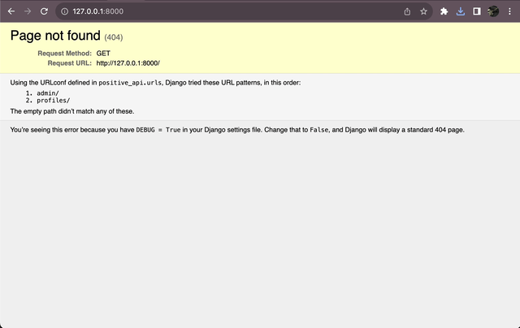
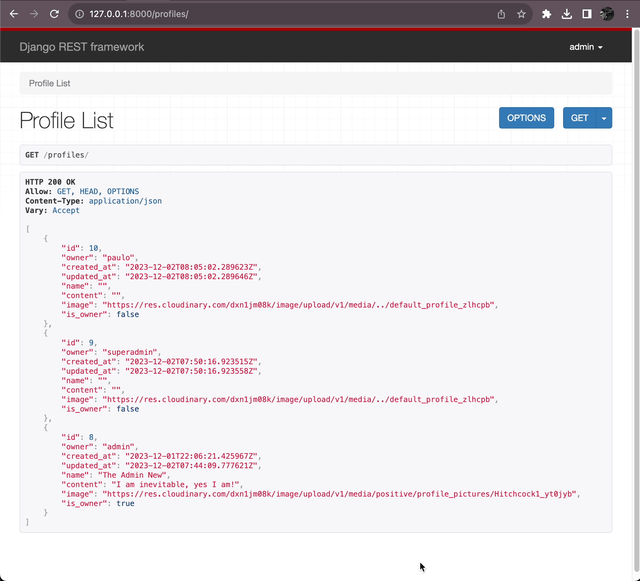
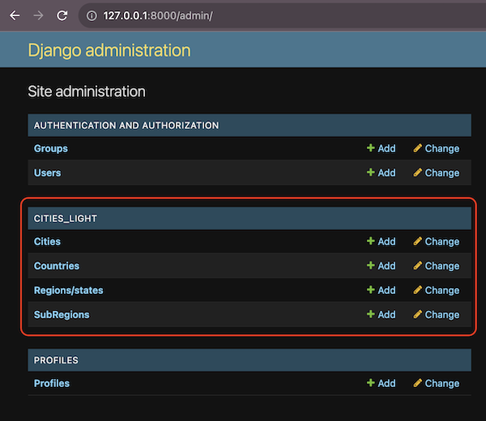
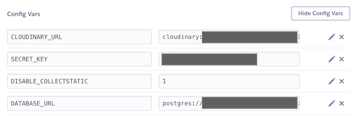

# THE POSITIVE SOCIAL NETWORK API


Welcome,

This is the Positive Social Network API, a project for the Code Institute Full Stack Software Development Diploma.

[View Postive on Heroku](https://thewcwebpage-83a6428384c3.herokuapp.com)


---

## Table of Contents

- [Introduction](#introduction)
- [Basic configuration](#basic-configuration)
- [Creating the apps](#creating-the-apps)
- [Entities Relationship Diagram (ERD)](#entities-relationship-diagram-erd)
- [Profiles app](#profiles-app)
  - [Serializers](#serializers)
  - [Permissions](#permissions)
- [Places app](#places-app)
- [Posts app](#posts-app)
- [Likes app](#likes-app)
    - [Likes usage in other views](#likes-usage-in-other-views)
- [Deployment](#deployment)
    - [JWT Authentication](#jwt-authentication)
    - [Setting up the home page](#setting-up-the-home-page)
    - [Pagination](#pagination)
    - [json as render format](#json-as-render-format)
    - [Heroku](#heroku)

## Introduction

This project is a Django API for the Positive Social Network, a social network for people to share only positive reviews of restaurants, bars, hotels, etc.
Why only positive reviews? Because we want to create a positive environment for people to share their experiences and recommendations. We believe that there are already too many negative reviews on the internet, and we want to change that.

In my experience as a movie and music reviewer, people feel also attracted to check the negatively scored movies. We humans are curious by nature, and we want to know why a movie is so bad, or why a restaurant is so bad. We even want to contradict others opinions, so we also want to prove people wrong. This is why I believe that a social network with only positive reviews will be a success. Not only because really good places will have more notoriety, but also because people won't have information about bad places, so these places will need to strive harder to at least, have presence in the Internet.

Also, when one writes a negative review, it is very easy to get carried away and write a very long one, losing even scope. But, when one writes a positive review, needs to really focus on explaining why the place is so good, and this is a good exercise for the brain and also, to hihglight why the place is worth visiting.

## Basic configuration

Start by installing Django (in this case, I used the latest version to date 4.2.7)

```bash
pip3 install django
```

Then, create a new project

```bash
django-admin startproject <project_name> .
```

My project name is positive_api, as I will be creating an API for the Positive Social Network.

NOTE: The dot at the end of the command is to create the project in the current directory. Please, do not forget it (I know why I am saying this ;-) ).

We are going to use CLOUDINARY to store the images of the users. So, we need to install the cloudinary package

```bash
pip install django-cloudinary-storage
```

Then, we need to install also [Pillow](https://pypi.org/project/Pillow/), which is a Python Imaging Library

```bash
pip install Pillow
```

But, I know that when you are reading (or even watching tutorials), you are to install and do things that you don't know what they are for. So, check this YouTube video that will tell you what is Pillow and why we need it.

[](https://www.youtube.com/watch?v=6Qs3wObeWwc)

Add the Cloudinary storage to the INSTALLED_APPS in the settings.py file (following the order below)

```python
    ...
    'django.contrib.messages',
    'cloudinary_storage',
    'django.contrib.staticfiles',
    'cloudinary',
    ...
```

Now, as we don't want to make the variables and keys of our accounts public, we need to create a .env file in the root of our project.

```python
import os
os.environ['CLOUDINARY_URL'] = 'cloudinary://YOUR_CLOUDINARY_URL'
```

Then, we need to add the following lines to the settings.py file

```python
from pathlib import Path
import os

if os.path.exists('env.py'):
    import env

# Cloudinary
CLOUDINARY_STORAGE = {
    'CLOUDINARY_URL': os.environ.get('CLOUDINARY_URL')
}

MEDIA_URL = '/media/'
DEFAULT_FILE_STORAGE = 'cloudinary_storage.storage.MediaCloudinaryStorage'
```

The MEDIA_URL is the URL where the images will be stored by Django. In this case, we will use the default one, which is /media/

## Creating the apps

Now, we need to create the apps that we will use in our project. In this case, we will create the following apps:

- profiles
- posts
- comments
- likes

To create an app, we need to run the following command

```bash
python3 manage.py startapp <app_name>
```

Then, we need to add the app to the INSTALLED_APPS in the settings.py file

```python
    ...
    'django.contrib.messages',
    'cloudinary_storage',
    'django.contrib.staticfiles',
    'cloudinary',
    'profiles',
    'posts',
    'comments',
    'likes',
    ...
```

## Entities Relationship Diagram (ERD)



**NOTE:** The Country and City models are created by the  package.


### Profiles app

This app will be used to manage the users of the Positive Social Network. We will use the default Django User model, but we will add some extra fields to it.

Then, we need to add the app to the INSTALLED_APPS in the settings.py file

```python
    ...
    'django.contrib.messages',
    'cloudinary_storage',
    'django.contrib.staticfiles',
    'cloudinary',
    'profiles',
    'posts',
    'comments',
    'likes',
    ...
```

The profiles will have the following fields:

- owner
- name
- created_at
- updated_at
- content
- image

After creating the model, we need to create a signals.py file in the profiles app.

Signals are just pieces of code that are executed when a certain action is performed or there is an event. In this case, we want to create a profile for each user that is created.

```python
def create_profile(sender, instance, created, **kwargs):
    if created:
        Profile.objects.create(owner=instance)

post_save.connect(create_profile, sender=User)
```

Basically, we are saying that when a user is created, we want to create a profile for that user. Remember, a user is not the same as a profile. A user is the one that logs in, and a profile is the one that is shown in the social network.

Make migrations and migrate

Remember to add the Profile to your admin panel, and a superuser to be able to log in.
All this was covered in my previous project, [The WC](https://github.com/Parbelaez/ci_fsd_pp4_the_wc/blob/main/README.md).

Now we have a Profile working model with images.



#### Serializers

After creating the views and the urls, we will recieve the folowing error:



The Back-End and Front-End need to share data between each other, but up to now, Django is retutning everything in html format and the FE will receive only JSON data. Serializers create this translation, from one format to the other. Therefore, we need to create the serializers for the profiles app.

Django has a built-in serializer, but we will use the [Django REST Framework](https://www.django-rest-framework.org/), which is a powerful and flexible toolkit for building Web APIs.

```bash
pip install djangorestframework
```

Then, we need to add the following lines to the settings.py file

```Python
INSTALLED_APPS = [
    ...
    'rest_framework',
    ...
]
```

Then we need to create a serializers.py file in the profiles app.
(Check the serializers.py file in the profiles app and how it was used in the views.py file)

After this, we will be able to see the JSON data in the browser from the newly created view.


With the serializer now created, we can add all CRUD functionalities to the profiles app.

Please, check the code, as it is commented and it is very easy to understand.

Feel free to read also the TESTING.md file, where I explain how to test the API, and you can also find videos of all functionalities.

#### Permissions

Now, we need to add permissions to the profiles app. Permissions are rules that define who can access what in our API. For example, we don't want that a user can delete or edit another user's profile.

For that, we need to create a permissions.py file in the main folder (positive_api), because this permissions will be used on different apps around the API.

Please, check the permissions.py file in the main folder.



### Places app

This app will be used to manage the places of the Positive Social Network.
The list of categories will be the following:

- Restaurant
- Bar
- Hotel
- Museum
- Park
- Beach
- Other

The places will have the following fields:

- owner
- created_at
- updated_at
- place_name
- place_type
- address
- city
- country
- website
- phone_number
- description
- image

The model and serializer are following the same logic as the profiles app, so I will not explain it again.

But, the creation of the places is a bit different, as we need to create a new view that will be used to create the places.

The reason for this is that we need to check first if the place already exists in the database, and if it does, we will inform that.

Please, refer to the views.py file in the places app to see how the generic views are used. And, most importantly, how the get_or_create method is used.

```python
def perform_create(self, serializer):
        place, created = Place.objects.get_or_create(
            place_name=self.request.data.get('place_name'),
            city=self.request.data.get('city'),
            defaults={'owner': self.request.user}
        )
        if not created:
            raise ValidationError(
                "A place with this name and city already exists."
                )
```

#### Adding django-cities-light to the project

We will use the  package to get the cities and countries from the database.

```bash
pip install django-cities-light
```

Then, we need to add the following lines to the settings.py file

```python
INSTALLED_APPS = [
    ...
    'cities_light',
    ...
]
```

Then, we need to run the migrations

```bash
python3 manage.py migrate
Operations to perform:
  Apply all migrations: admin, auth, cities_light, contenttypes, likes, places, posts, profiles, sessions
Running migrations:
  Applying cities_light.0001_initial... OK
  Applying cities_light.0002_city... OK
  Applying cities_light.0003_auto_20141120_0342... OK
  Applying cities_light.0004_autoslug_update... OK
  Applying cities_light.0005_blank_phone... OK
  Applying cities_light.0006_compensate_for_0003_bytestring_bug... OK
  Applying cities_light.0007_make_country_name_not_unique... OK
  Applying cities_light.0008_city_timezone... OK
  Applying cities_light.0009_add_subregion... OK
  Applying cities_light.0010_auto_20200508_1851... OK
  Applying cities_light.0011_alter_city_country_alter_city_region_and_more... OK
```

And, if we go to the admin panel, we will see that we have the cities and countries in the database.



Then, we need to load the data (populate the database) with the following command:

```bash
python3 manage.py cities_light
```

### Posts app

This app will be used to manage the posts of the Positive Social Network. We will use the default Django User model, but we will add some extra fields to it.

The posts will have the following fields:

- owner
- title
- created_at
- updated_at
- visit_date
- content
- image
- recomendation

The model and serializer are following the same logic as the profiles app, so I will not explain it again.

But, we added a Image Filter and Validation. This is because we want to make sure that the image that is uploaded is a valid image.

The image filter is defined in the models.py file

```python
image_filter = models.CharField(
        max_length=32,
        choices=image_filter_choices,
        default='normal'
        )
```

And the validation is defined in the serializers.py file

```python
def validate_image(self, value):
        # We check if the image is bigger than 2MB
        if value.size > 1024 * 1024 * 2:
            raise serializers.ValidationError(
                'The maximum file size that can be uploaded is 2MB'
                )
        # We validate if the image width is bigger than 4096px
        if value.width > 4096:
            raise serializers.ValidationError(
                'The maximum width allowed is 4096px'
                )
        # We validate if the image height is bigger than 4096px
        if value.height > 4096:
            raise serializers.ValidationError(
                'The maximum height allowed is 4096px'
                )
        # We validate if the image format is not supported
        if value.content_type not in ['image/jpeg', 'image/png']:
            raise serializers.ValidationError(
                'The allowed formats are JPEG and PNG'
                )
        # We return the value if it is compliant with our requirements
        return value
```

Now, a visit cannot take place in the future, so we need to add a validation for that. This validation will be added to the serializer.

```python
def validate_visit_date(self, value):
        if value > date.today():
            raise serializers.ValidationError(
                'The visit date cannot be in the future'
                )
        return value
```

### Likes app

This app will be used to manage the likes of the Positive Social Network.

In this case, we will use a like system similar to the new (as of 2023) from Netflix, with three clasess of like:

- Top: a cannot miss place
- Like: good and agree with the post
- Dislike: do not agree with the post

Remember that every single post with be a positive review, so the dislike is not related to the post itself, but with the appreciation of the user regarding the reviewed place.

The likes will have the following fields:

- owner
- post
- created_at
- like_type

From the likes model we need a new condition, and is that every post can be liked just once by the same user. So, we need to add a unique_together condition to the Meta class of the model.

```python
class Meta:
        unique_together = ('user', 'post')
```

And, in the serializer, we need to add the following try/except block to the create method

```python
def create(self, validated_data):
        try:
            # super() is used to call the create method of the parent class
            # in this case, ModelSerializer
            return super().create(validated_data)
        except IntegrityError as err:
            raise serializers.ValidationError({
                'detail': 'It seems like you already liked this post'
            }) from err
```

Now comes an interesting part. In the previous views, we have always serialized, deserialized, create, update and delete repitively. But, Django offers a shortcut to do this with .

So, we will create a new file called views.py in the likes app, and we will import the generic from DRF.

```python
from rest_framework import generics
```

Please, refer to the views.py file in the likes app to see how the generic views are used.

But, basically, the most important parts are these:

```python
class LikeList(generics.ListCreateAPIView):
```

ListCreateAPIView is a generic view that provides GET (list) and POST method handlers.

```python
class LikeDetail(generics.RetrieveUpdateDestroyAPIView):
```

RetrieveUpdateDestroyAPIView is a generic view that provides GET (retrieve), PUT (update), PATCH (partial update) and DELETE method handlers.

Therefore, there is no need to create the methods as before.

**_NOTE 1:_** some views were left as they are (no refactoring), because they are intended to be a sample of the different ways to create views.

**_NOTE 2:_** the places view was created after the posts and likes views, therefore, it was not stated in this README.md that we used generics.

#### Likes usage in other views

We need to see what posts has each user liked, and what type of like has been used (if liked). And, this is something that we will handle in the posts serializer.

First, create a SerializerMethodField in the posts serializer:

```python
like_type = serializers.SerializerMethodField()
```

Then, create the get_like_type method in the posts serializer:

```python
def get_like_type(self, obj):
    try:
        like = Like.objects.get(
            user=self.context['request'].user,
            post=obj
        )
        return like.like_type
    except Like.DoesNotExist:
        return None
```

Lastly, add the like_type to the fields in the Meta class of the posts serializer:

```python
fields = (
    'id',
    'owner',
    'title',
    'created_at',
    'updated_at',
    'visit_date',
    'content',
    'image',
    'recomendation',
    'like_type'
)
```

And, it is also needed to have the count of like_types (how many tops, likes and dislikes) in the posts views.

```python
from django.db.models import Count, Q

queryset = Post.objects.annotate(
    num_top=Count('post_likes__like_type', filter=Q(post_likes__like_type='top')),
    num_like=Count('post_likes__like_type', filter=Q(post_likes__like_type='like')),
    num_dislike=Count('post_likes__like_type', filter=Q(post_likes__like_type='dislike'))
).order_by('-created_at')
```

And then, add the fields as well to the serializer:

```python
num_top = serializers.ReadOnlyField()
num_likes = serializers.ReadOnlyField()
num_dislikes = serializers.ReadOnlyField()
```

---

**IMPORTANT:** during the creation of some views, it was needed to delete the DB and create it again, because the get_or_create method was not working as expected. So, it was needed to install the django-extensions package, and run the following command:

```bash
python3 manage.py reset_db
```

After this, it is needed to run all migrations again.

Also, to check the DB, you can do it in the command line:

```bash
sqlite3 db.sqlite3
```

And, to see the tables:

```bash
.tables
```

To delete/truncate a table:

```bash
DELETE FROM <table_name>;
VACUUM;
```

---

## Deployment

### JWT Authentication

We will use JWT Authentication to authenticate users in our API. JWT stands for JSON Web Token, and it is a standard that defines a compact and self-contained way for securely transmitting information between parties as a JSON object. This information can be verified and trusted because it is digitally signed.

To install JWT Authentication, we need to run the following command:

```bash
pip install dj-rest-auth
```

Then, we need to add the following lines to the settings.py file

```python
INSTALLED_APPS = [
    ...
    'rest_framework.authtoken',
    'dj_rest_auth',
    ...
]
```

Then, we need to add the following lines to the urls.py file

```python
urlpatterns = [
    ...
    path('dj-rest-auth/', include('dj_rest_auth.urls')),
    ...
]
```

Now, we need to migrate the DB

```bash
python3 manage.py migrate
```

But, we also need the users to be able to register. For this, we will use the dj-rest-auth package, which is a set of REST API endpoints for authentication. It is built on top of Django REST Framework.

To install dj-rest-auth, we need to run the following command:

```bash
pip install dj-rest-auth[with_social]
```

Then, we need to add the following lines to the settings.py file

```python
INSTALLED_APPS = [
    ...
    'django.contrib.sites',
    'allauth',
    'allauth.account',
    'allauth.socialaccount',
    'dj_rest_auth.registration',
    ...
]
```

...and add the flag: SITE_ID = 1

(But, why? you may ask. I did too... this post has a very good explanation: https://stackoverflow.com/questions/25468676/django-sites-model-what-is-and-why-is-site-id-1)

Then, we need to add the following lines to the urls.py file

```python
urlpatterns = [
    ...
    path('dj-rest-auth/registration/', include('dj_rest_auth.registration.urls')),
    ...
]
```

And, now... FINALLY, the tokens:

```bash
pip install djangorestframework_simplejwt
```

DRF does not support JWT out of the box (basically, we need to use session authentication in the development, and JWT for production... yeah, it sucks...), so we need to:

1. Create a DEV variable in the env.py file:

    ```python
    os.environ['DEV'] = 'True'
    ```

2. Use that variable to check if we are in development or production:

    ```python
    REST_FRAMEWORK = {
        'DEFAULT_AUTHENTICATION_CLASSES': [(
            'rest_framework.authentication.SessionAuthentication'
            if 'DEV' in os.environ and os.environ['DEV'] == 'True'
            else 'dj_rest_auth.jwt_auth.JWTCookieAuthentication'
        )]
    }

    REST_USE_JWT = True
    JWT_AUTH_SECURE = True
    JWT_AUTH_COOKIE = 'jwt-auth'
    JWT_AUTH_REFRESH_COOKIE = 'jwt-refresh-auth'
    ```

3. Create a serializers.py file in the project folder (positive_api).

4. Modify the settings.py file adding:

    ```python
    REST_AUTH_SERIALIZERS = {
    'USER_DETAILS_SERIALIZER': 'positive_api.serializers.CurrentUserDetailSerializer'
    }
    ```
5. allauth.account.middleware.AccountMiddleware must be added to settings.MIDDLEWARE

6. Add the following lines to the urls.py file

    ```python
    MIDDLEWARE = [
    ...
    'allauth.account.middleware.AccountMiddleware',
    ...]
    ```

7. Run the migrations

### Setting up the home page

It is not mandatory, but it would be good to have a page that indicates that the API is working. For that, we will create a views.py file in the main folder (positive_api), and will use the api_view decorator from DRF.

Please, refer to the file to see how it was done.

### Pagination

Easy-peasy... just add the following lines to the settings.py file

```python
REST_FRAMEWORK = {

    ...

    'DEFAULT_PAGINATION_CLASS':
        'rest_framework.pagination.PageNumberPagination',
    'PAGE_SIZE': 10,
}
```

### json as render format

We only need the html format for development, but we need the json format for production. So, we need to add the following lines to the settings.py file

```python

if 'DEV' not in os.environ:
    REST_FRAMEWORK = {
        'DEFAULT_RENDERER_CLASSES': [
            'rest_framework.renderers.JSONRenderer',
        ]
    }
```

### Heroku

The API was deployed to Heroku, and the database used was Postgres.

So, for this project, we are using ElephantSQL, which is a PostgreSQL database hosting service.

Then, install the following packages:

```bash
pip3 install dj_database_url psycopg2
```

Then, we need to add the following lines to the settings.py file

```python
import dj_database_url
```

...and update the DATABASES variable

```python
 if 'DEV' in os.environ:
     DATABASES = {
         'default': {
             'ENGINE': 'django.db.backends.sqlite3',
             'NAME': BASE_DIR / 'db.sqlite3',
         }
     }
 else:
     DATABASES = {
         'default': dj_database_url.parse(os.environ.get("DATABASE_URL"))
     }
```

In your env.py file, you need to add the following line:

```python
os.environ['DATABASE_URL'] = "<your PostgreSQL URL here>"
```

Then migrate and create your new superuser for the new DB

```bash
python3 manage.py migrate
python3 manage.py createsuperuser
```

You already know how to create an app in Heroku (if not, please refer to my previous project README.md file at [The WC readme](https://github.com/Parbelaez/ci_fsd_pp4_the_wc/blob/main/README.md)), but I will show you the variables setup, anyway:



Create the Procfile in the root of the project, and add the following lines:

release: python manage.py makemigrations && python manage.py migrate
web: gunicorn your_api_name.wsgi

**NOTE 1:** the your_api_name is the name of your project, in this case, positive_api.
**NOTE 2:** please, PLEASE, do not do what I always do (by mistake) to create the Procfile in the project folder. It should be in the root of the project (where the manage.py, README.md, and requirements.txt reside). Unless, your app will not launch in Heroku.

As we will be using postgres, we need to install the following packages:

```bash
pip3 install gunicorn django-cors-headers
```

Update the requirements.txt file.

Add the app to the INSTALLED_APPS in the settings.py file:

```python
INSTALLED_APPS = [
    ...
    'corsheaders',
    ...
]
```

...and the middleware

```python
MIDDLEWARE = [
    ...
    'corsheaders.middleware.CorsMiddleware',
    ...
]
```

Add the url to the allowed hosts in the settings.py file (remember that heroku is using a different url creation model, therefore, you need to check exactly the url that has been assigned to your app)


```bash
web: gunicorn positive_api.wsgi:application
```

Then, we need to install gunicorn

```bash
pip3 install gunicorn
```

Then, we need to create a requirements.txt file

```bash
pip3 freeze > requirements.txt
```

## Bugs

### Solved

#### 1. dj-rest-auth

(Taken from the [Code Institute DRF](https://learn.codeinstitute.net/courses/course-v1:CodeInstitute+DRF+2021_T1/courseware/a6250c9e9b284dbf99e53ac8e8b68d3e/0c9a4768eea44c38b06d6474ad21cf75/?child=first) tutorial)

It turns out that dj-rest-auth has a bug that doesn’t allow users to log out (ref: DRF Rest Auth Issues).

The issue is that the samesite attribute we set to ‘None’ in settings.py (JWT_AUTH_SAMESITE = 'None') is not passed to the logout view. This means that we can’t log out, but must wait for the refresh token to expire instead.

Proposed Solution: One way to fix this issue is to have our own logout view, where we set both cookies to an empty string and pass additional attributes like secure, httponly and samesite, which was left out by mistake by the library.

All fixes are indicated in the code with the comment: # dj-rest-auth bug fix workaround.