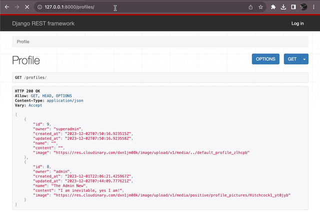
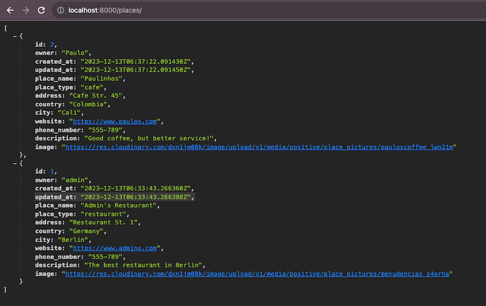
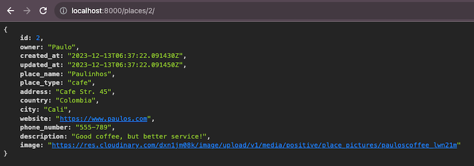
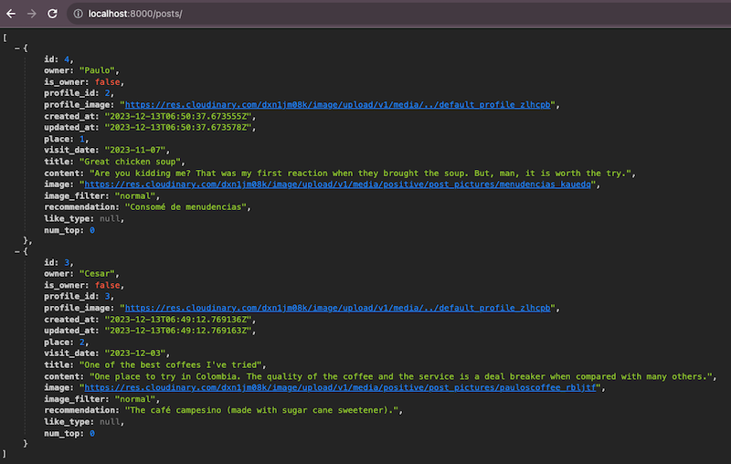
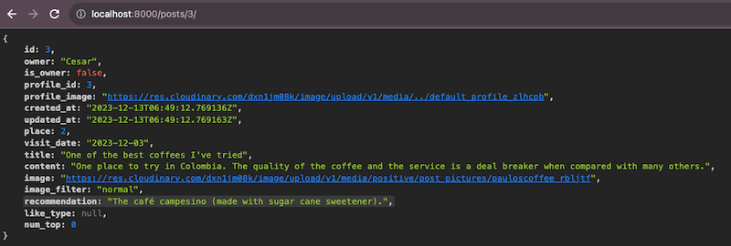
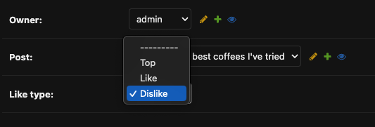
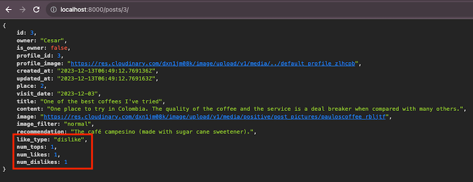
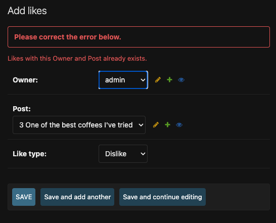

# PP5 - THE POSITIVE SOCIAL NETWORK API TESTING

## TABLE OF CONTENTS

* [AUTOMATED TESTING](#automated-testing)
    * [JSHINT](#jshint)
    * [PEP8](#pep8)
* [MANUAL TESTING](#manual-testing)
    * [Root Route](#root-route)
    * [Profile](#profile)
    * [Places](#places)
    * [Posts](#posts)
    * [Likes](#likes)
    * [Full Testing](#full-testing)

## AUTOMATED TESTING

### JSHINT

No specific JavaScript code was used in the project. All the JavaScript code was provided by the libraries and frameworks used.

### PEP8

The code was validated using [PEP8](https://pep8ci.herokuapp.com/#). The only errors found were related to the length of the lines, that being such an extensive project, it was impossible to keep the lines under 79 characters.

## MANUAL TESTING

In this section is included not only the functional parts of the webpage, but also the design and responsiveness of it. The testing includes the requirements of the project, and the additional features added comming from the user stories included in the [project](https://github.com/users/Parbelaez/projects/1).

### Root Route

| Goals | How are they achieved? | Image |
| :--- | :--- | :--- |
| The user has a cleat indication that the API is running | Implementing a root_route function |  |

### Authentication

| Goals | How are they achieved? | Image |
| :--- | :--- | :--- |
| The user can create an account | Using Django's built-in authentication system + Allauth | NOTE: full process shown in the FE README and TESTING files  |
| --- | --- | --- |
| The user can log in | Using Django's built-in authentication system + Allauth |   |

### Admin Panel

| Goals | How are they achieved? | Image |
| :--- | :--- | :--- |
| The admin panel is accessible only for superusers | Using Django's built-in authentication system |  |

### Profile

| Goals | How are they achieved? | Image |
| :--- | :--- | :--- |
| The profiles can be acceced in JSON format | By creating the whole app and managing the settings correctly as explained in the README |  |
| --- | --- | --- |
| The profiles details can be acceced in JSON format | By creating the whole app and managing the settings correctly as explained in the README |  |

### Image upload to Cloudinary

| Goals | How are they achieved? | Image |
| :--- | :--- | :--- |
| The images are uploaded to Cloudinary | Using the Cloudinary API and the Cloudinary widget |  |

### Places

| Goals | How are they achieved? | Image |
| :--- | :--- | :--- |
| The places can be acceced in JSON format | By creating the whole app and managing the settings correctly as explained in the README |  |
| --- | --- | --- |
| The places details can be acceced in JSON format | By creating the whole app and managing the settings correctly as explained in the README |  |

### Posts

| Goals | How are they achieved? | Image |
| :--- | :--- | :--- |
| The posts can be acceced in JSON format | By creating the whole app and managing the settings correctly as explained in the README |  |
| --- | --- | --- |
| The posts details can be acceced in JSON format | By creating the whole app and managing the settings correctly as explained in the README |  |

### Likes

| Goals | How are they achieved? | Image |
| :--- | :--- | :--- |
| The user can choose between three different types of likes: top, like, dislike | By creating the whole app and managing the settings correctly as explained in the README |  |
| The likes can be acceced in JSON format | By creating the whole app and managing the settings correctly as explained in the README |  |
| --- | --- | --- |
| The user can only like one post once | By creating the whole app and managing the settings correctly as explained in the README |  |

### Testing Devices

Full testing was performed on the following devices:

* Laptop:
  * Macbook Pro 2022 16 inch screen 