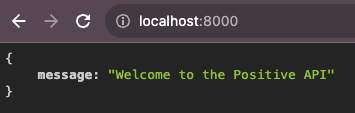
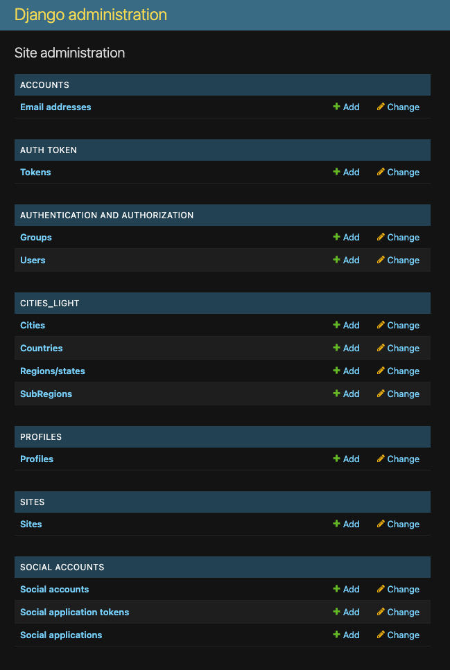
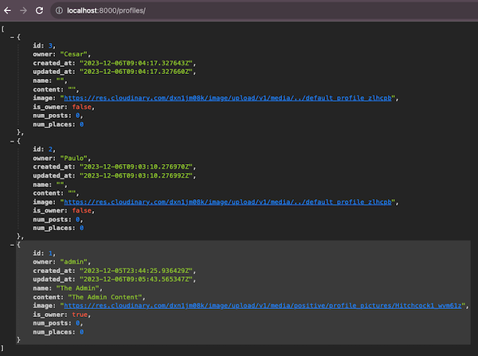
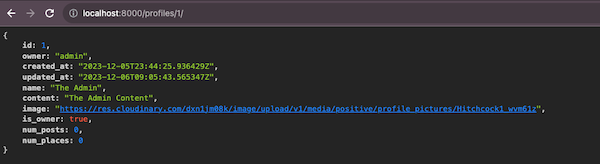

# PP5 - THE POSITIVE SOCIAL NETWORK API TESTING

## TABLE OF CONTENTS

* [AUTOMATED TESTING](#automated-testing)
    * [JSHINT](#jshint)
    * [PEP8](#pep8)
* [MANUAL TESTING](#manual-testing)
    * [Root Route](#root-route)
    * [Profile](#profile)
    * [Places](#places)
    * [Posts](#posts)
    * [Likes](#likes)
    * [Full Testing](#full-testing)

## AUTOMATED TESTING

### JSHINT

No specific JavaScript code was used in the project. All the JavaScript code was provided by the libraries and frameworks used.

### PEP8

The code was validated using [PEP8](https://pep8ci.herokuapp.com/#). The only errors found were related to the length of the lines, that being such an extensive project, it was impossible to keep the lines under 79 characters.

## MANUAL TESTING

In this section is included not only the functional parts of the webpage, but also the design and responsiveness of it. The testing includes the requirements of the project, and the additional features added comming from the user stories included in the [project](https://github.com/users/Parbelaez/projects/1).

### Root Route

| Goals | How are they achieved? | Image |
| :--- | :--- | :--- |
| The user has a cleat indication that the API is running | Implementing a root_route function |  |

### Admin Panel

| Goals | How are they achieved? | Image |
| :--- | :--- | :--- |
| The admin panel is accessible only for superusers | Using Django's built-in authentication system |  |

### Profile

| Goals | How are they achieved? | Image |
| :--- | :--- | :--- |
| The profiles can be acceced in JSON format | By creating the whole app and managing the settings correctly as explained in the README |  |
| --- | --- | --- |
| The profiles details can be acceced in JSON format | By creating the whole app and managing the settings correctly as explained in the README |  |

### Image upload to Cloudinary

| Goals | How are they achieved? | Image |
| :--- | :--- | :--- |
| The images are uploaded to Cloudinary | Using the Cloudinary API and the Cloudinary widget |  |

### Places

| Goals | How are they achieved? | Image |
| :--- | :--- | :--- |
| The notifications and messages are displayed properly after the user has performed actions like: loging in, loging out, comment a writing, among other | Mapping the messages and displaying them using Bootstrap's notification banners |  |
| --- | --- | --- |
| The notifications and messages are displayed for 3 seconds | Inserting a JS script in the base.html file |  |

### Posts

| Goals | How are they achieved? | Image |
| :--- | :--- | :--- |
| The user can create an account | Using Django's built-in authentication system + Allauth |  |
| --- | --- | --- |
| The user can log in | Using Django's built-in authentication system + Allauth |  |
| --- | --- | --- |
| The user can log out | Using Django's built-in authentication system + Allauth |  |

### Likes

| Goals | How are they achieved? | Image |
| :--- | :--- | :--- |
| The user can create a writing | Using forms and Summernote, the user is having a full text editor experience |  |
| --- | --- | --- |
| The user can edit a writing | Using forms and Summernote, the user is having a full text editor experience |  |
| --- | --- | --- |
| The user can delete a writing | Using Django's DeleteView |  |

### Full Testing

Full testing was performed on the following devices:

* Laptop:
  * Macbook Pro 2022 16 inch screen 